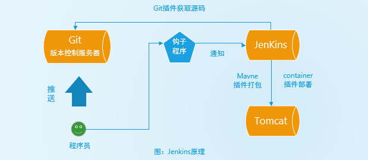

# Jenkins简介

[Jenkins](https://jenkins.io/)是一个独立的开源软件项目，是基于Java开发的一种持续集成工具，用于自动执行与构建，测试，交付或部署软件相关的各种任务。旨在提供一个开放易用的软件平台，使软件的持续集成变成可能。

#### 重要概念：

持续集成：是一个开发的实践过程，软件开发过程中往往需要开发人员定期集成代码到共享存储库（Svn/Git/Maven等），集成时必须要做相关的构建以消除发现的问题。持续集成要求开发人员有频繁的构建，一般情况下每当一个代码提交时，构建应该被手动或自动触发。

#### Jenkins工作流程：

程序员提交代码到Git/SVN仓库，触发**钩子程序**向 Jenkins 进行通知，Jenkins 调用Git/SVN插件获取源码，调用Maven打包为war包，调用Deploy to web container插件部署到Tomcat服务器。

#### 为什么选择Jenkins：

- 提供更为友好的用户界面，不论是新建一个build，还是日常使用，你需要做的大部分时候仅仅是在用户界面上选择和点击而已；
- 内置的功能强大，基本可以完成常用的开发构建任务；
- 有完善的文档，使用起来非常简单方便，大大降低了学习成本；
- 有丰富的插件，并且可根据自己的业务需求进行定制开发；
- 安装部署简单，独立部署或放到Tomcat中即可完成部署；
- 可完成的工作很多，借助丰富的插件静态检查、动态检查、编译、部署、测试等等几乎无所不能；