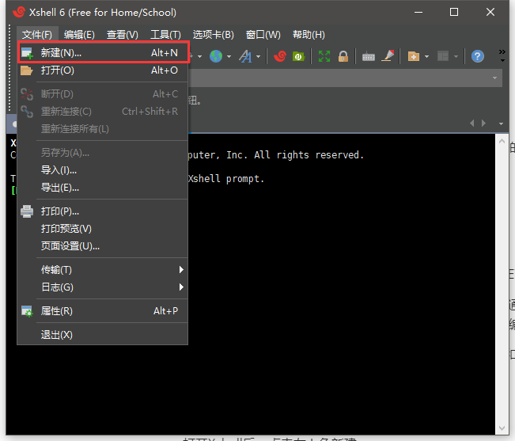
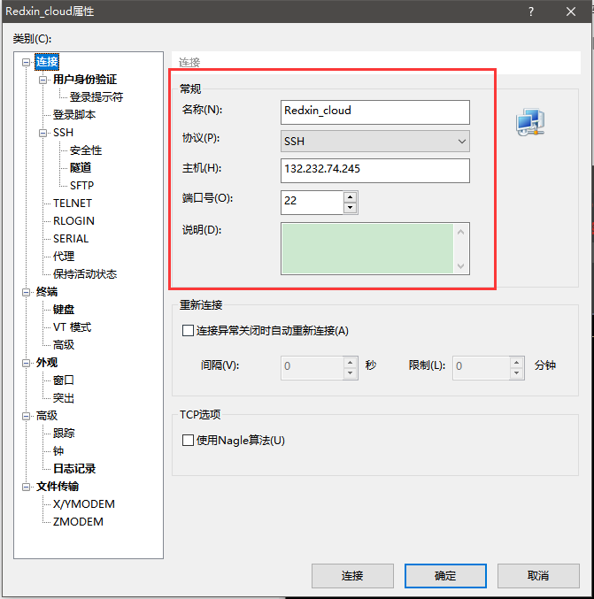
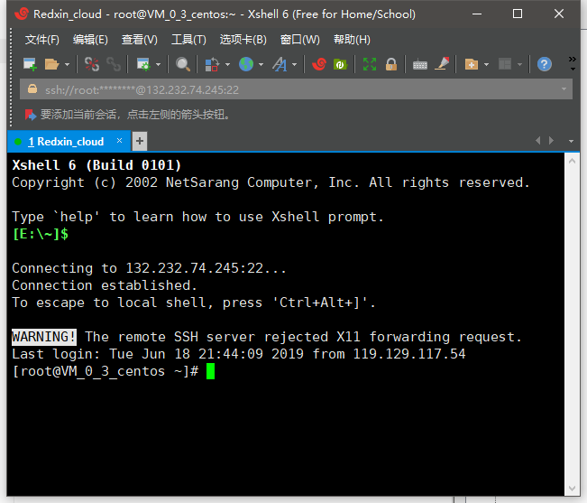
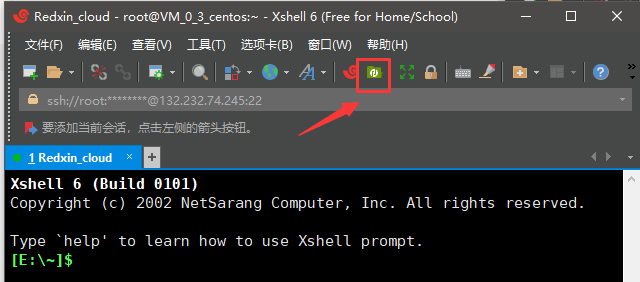
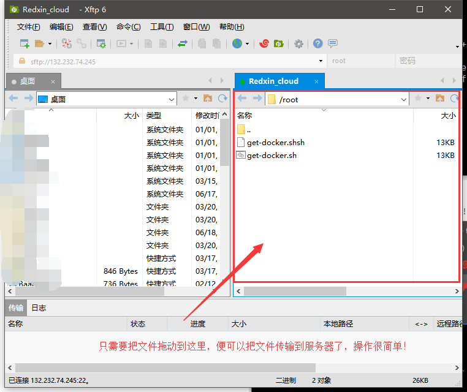
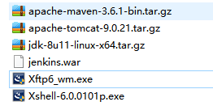

# 环境准备

#### **在学习使用之前，系统应需要具备以下环境：**

- Java运行环境 Jdk
- 项目构建工具 Maven
- 服务器部署工具 Tomcat
- 版本控制工具 Git/Svn（本例将使用Git）

接下来将一一介绍如何在linux下安装这4个工具，如已具备条件的开发者可直接跳过环境准备步骤。

#### **linux工具推荐：**Xshell + Xftp

官网：<http://www.xshellcn.com/>

Xshell是一个功能强大的终端模拟器,支持SSH,SFTP、TELNET、远程登录命令连接。

Xftp是一个灵活和轻量级SFTP / FTP客户端用户需要安全地通过网络传输文件。它提供了强大的功能,如直接编辑多个窗格,文件夹同步,他们支持,服务器到服务器转移和第三方编辑器集成。 

简单的说: Xshell让本地和服务器之间产生连接,Xftp让本地和服务器之间进行文件交换(上传和下载).

下载和安装都很简单，这里不做讲解。

**使用方法：**

1.打开Xshell后，点击左上角新建

2. 输入主机和端口号等信息，并根据提示输入用户及密码，即可进入终端界面，并愉快的进行命令行操作了。

   

   

3. 打开Xftp方法：点击Xshell工具栏上方按钮即可

   

   

------

**本教程所需软件资源分享（嘘~自己偷偷用就行哈~）：**

百度云：https://pan.baidu.com/s/1F1N8-CMPfZgIkUnjUhF3WQ

提取码：`d7rk`

