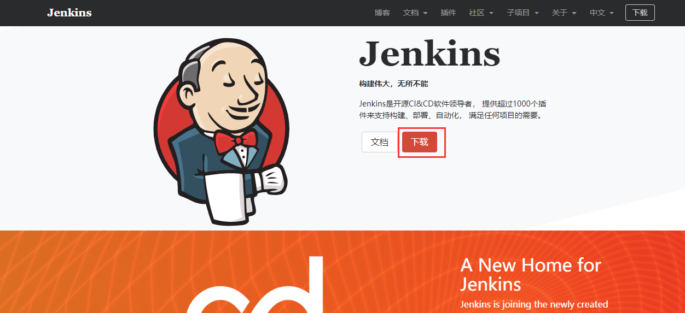

# Jenkins安装

### 一.下载Jenkins

Jenkins官网：<https://jenkins.io>

Jenkins有多种安装方式，本例将使用java开发者最常用的方式：war包安装

### 二.安装Jenkins

1.打开Xftp，进入`/opt/apache-tomcat-9.0.21/webapps`目录，并将Jenkins.war安装包拖入,传输完成后，打开终端，输入 `ll /opt` 列出opt目录下的文件,若显示有Jenkins.war安装包，表明传输成功。

2.打开终端启动tomcat（若tomcat本已启动的情况下可以忽略这一步）。

- ​	`cd /opt/apache-tomcat-9.0.21/bin`
- ​	`sh startup.sh`

3.打开浏览器，访问：`http://ip地址:8080/jenkins/` 稍等片刻，显示如下截图，表明jenkins已经在tomcat下部署完成。

### 三.解锁Jenkins，创建管理员用户

**1.获取初始管理员密码，并解锁。**

​	输入命令：`vim /root/.jenkins/secrets/initialAdminPassword`

​	可以看到初始化管理员密码在这里，复制出来粘贴到浏览器管理员密码输入框上，点击“继续”。

​	进入如下界面：

​	代理可以在安装完Jenkins之后在进行配置，插件安装在下一节将会进行一个单独的介绍，这里点击“跳过插件安装”。

**2.创建管理员用户**

可以选择自定义创建一个管理员用户，也可以选择不创建，使用初始管理员，账号:admin 密码为/root/.jenkins/secrets/initialAdminPassword文件中的密码。

本例选择创建一个新的管理员用户，名为“Redxin”，输入用户名密码等信息后，点击“保存并完成”。

**3.配置Jenkins URL**

如提示所描述，为了避免发生不必要的麻烦，这里的Jenkins URL推荐使用默认值。

**注意：这里配置的URL，将会是以后访问Jenkins的地址**

点击“保存并完成”，进入如下界面

到了这一步意味着Jenkins基本安装成功，点击 “开始使用Jenkins” 进入Jenkins主界面。

### 四.Jenkins初使用，注销与登录

Jenkins主界面。

1.点击右上角 “注销” 按钮，可进入登录界面。

**再一次提醒**，若未手动创建过管理员账户，那么需要以初始管理员登录

账号：admin

密码：/root/.jenkins/secrets/initialAdminPassword 文件中的密码

2.点击左上角系统管理，进入系统管理界面

(ps：这里安装完jenkins后会遇到一个问题：打开系统管理的时候会报” It appears that your reverse proxy set up is broken.”，在网上搜索了很多方法没有解决，不过这个可以先DIMISS，不影响我们环境的搭建)

