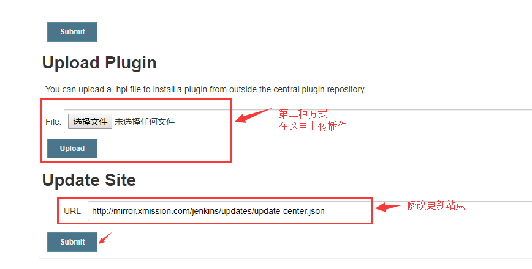

# Jenkins插件安装

### 一、安装方式


Jenkins插件安装有两种方式：

- **第一种方式**：在Jenkins的插件管理-搜索自己需要的插件，进行安装

- **第二种方式**：[官网](<https://plugins.jenkins.io/>)搜索自己需要的插件，下载后上传插件

本例使用第一种方式,直接在Jenkins插件管理中搜索插件进行安装。


### 二.修改“更新站点”

点击“系统管理”后进入“插件管理”界面，打开“Advanced”选项卡，修改更新站点




站点信息从：<https://updates.jenkins.io/update-center.json> 改为如下地址【三选一即可】

```
http://mirror.xmission.com/jenkins/updates/update-center.json   # 推荐
http://mirrors.shu.edu.cn/jenkins/updates/current/update-center.json
https://mirrors.tuna.tsinghua.edu.cn/jenkins/updates/update-center.json
```


### 三.安装插件

这里以安装GitHub插件为例，打开Available选项卡，搜索“Github”，选择相应插件，点击下方install按钮，等待下载安装即可。


安装完成后界面：


**本例所需安装插件如下，一一进行安装即可：**

maven相关插件：

```
Dependency Analyzer
Pipeline Maven Integration
Maven Integration
```

git相关插件：

```
GitHub
GitHub Organization Folder
GitHub Authentication
```

