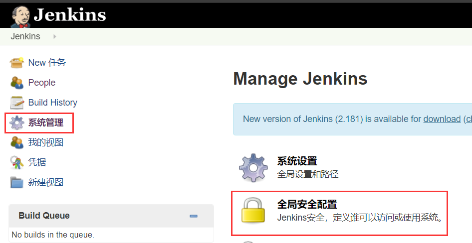
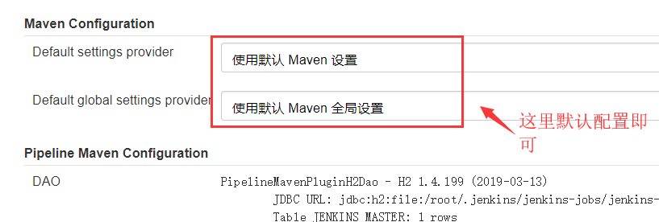
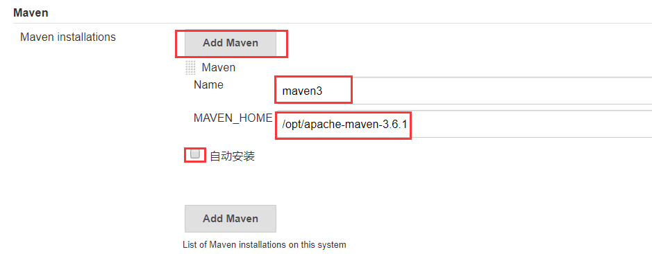
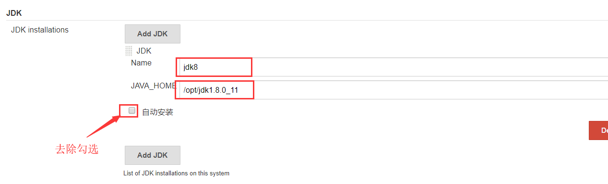
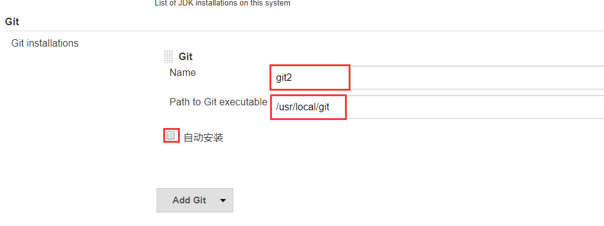
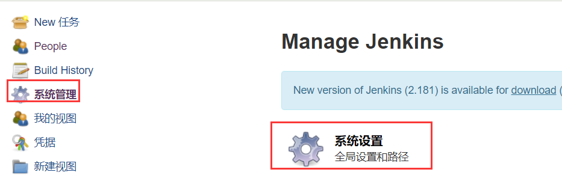
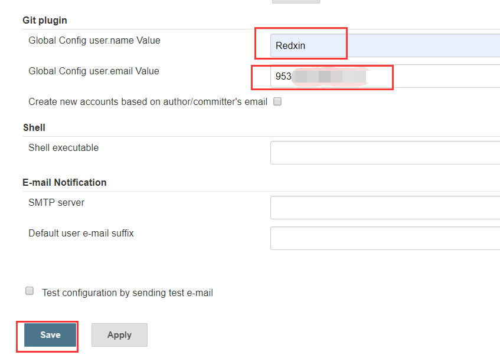

# Jenkins全局工具配置

插件装完之后，自然需要进行一系列的配置，将我们之前安装配置好的JDK、Maven、Git等工具整合到Jenkins之中。

**进入“系统配置” →  “全局工具配置”**

### 一.Maven配置

1.这里的Maven配置使用默认的配置就可以，不需要更改。

2.将页面拉到最底下，配置Maven的名称（随意）和安装目录，并去除勾选 “自动安装”

MAVEN_HOME：/opt/apache-maven-3.6.1

### 二.JDK配置

点击“Add JDk”，配置jdk的名称（随意）和安装目录，

并去除勾选 “自动安装”。

JAVA_HOME：/opt/jdk1.8.0_11

### 三.Git配置

同JDK一样，点击“Add Git”，配置Git的名称（随意）和目录（注意：这里的目录是“/usr/local/git/bin/git”）

并去除勾选 “自动安装”。

**Path to Git executable：/usr/local/git/bin/git**

**全局工具配置中还有其他不同的配置，有需要的可以自行配置，本例进行以上配置即可。**

点击“Apply”应用，并“Save”保存。

### 四.配置Git账户与邮箱

还需要告诉Jenkins我们的Git账户与邮箱，Jenkins才会以我们的git账户去操作各种“push”、“pull”等操作。

1.进入“系统管理” →  “系统配置”

2.配置Git账户邮箱，应用并保存

