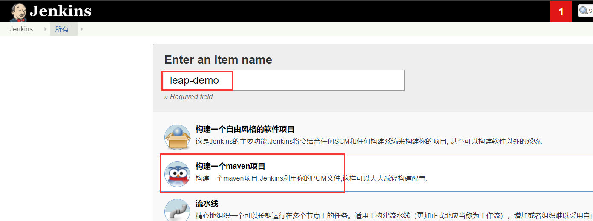
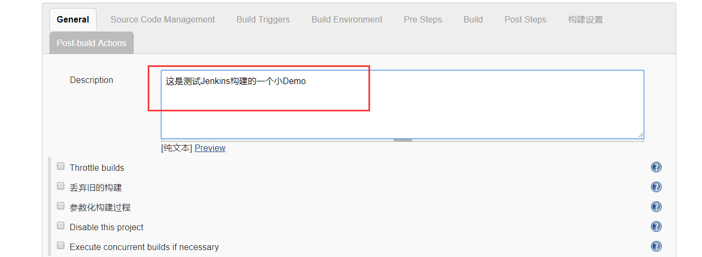
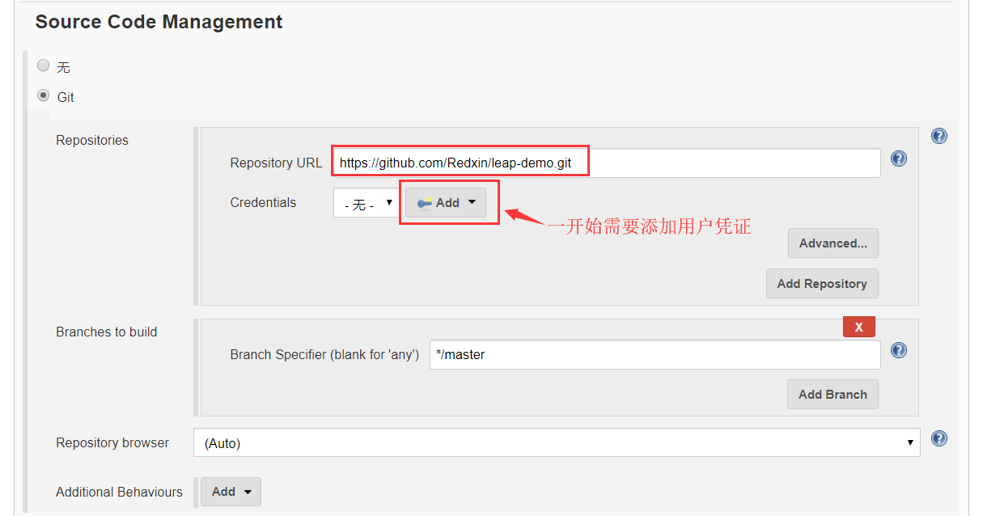
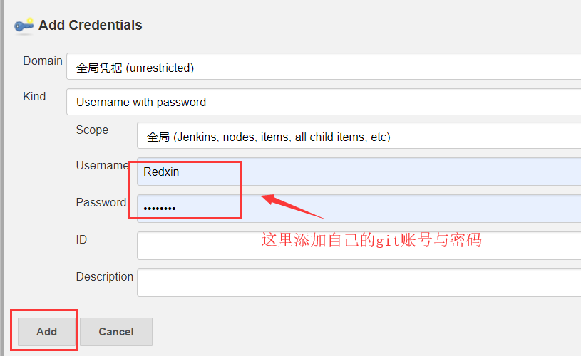
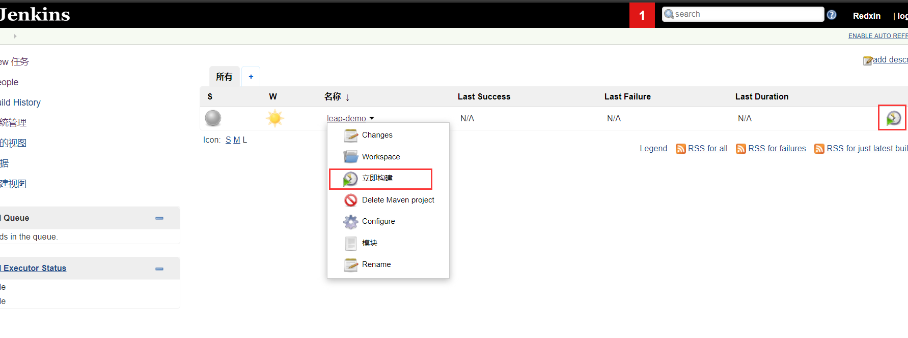
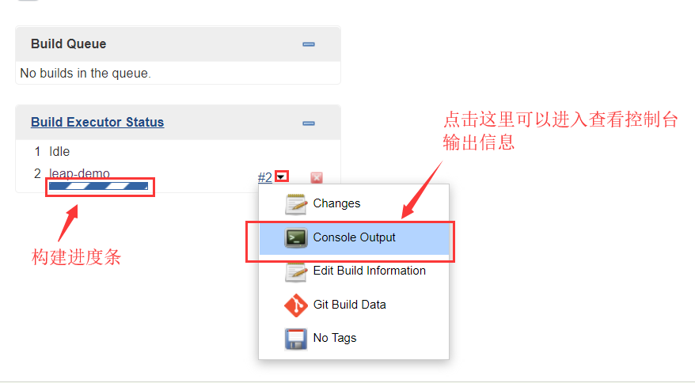
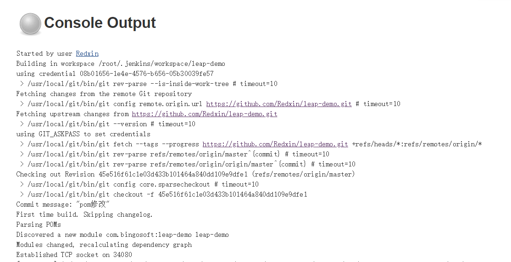
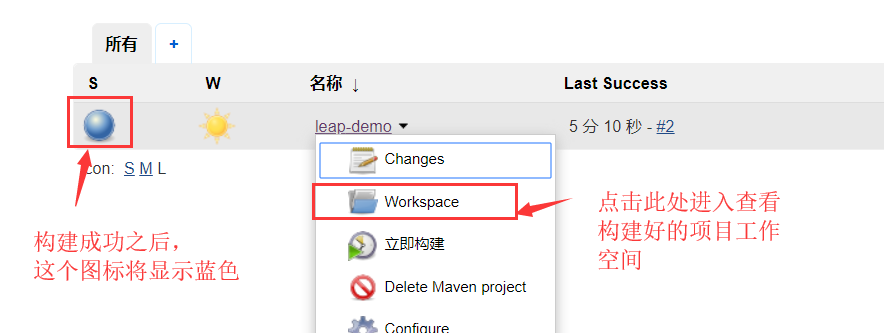
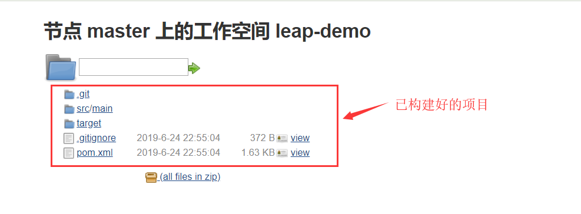

# 添加并构建Maven项目

工具配置好之后，就可以通过Jenkins进行一个git项目构建测试。

本例使用的项目为本教程2.5中的Leap小demo。

### 一.添加测试项目

1.进入Jenkins主页，点击左上角“new 任务”，选择并输入以下信息后点击“ok”

2.配置项目描述

3.选择git工具，输入测试项目的git地址（https://github.com/Redxin/leap-demo.git），并添加用户凭据

添加完之后选择已添加的凭据即可

**进行了以上配置即可，点击最下方“应用” 并 “保存”**

### 二.构建项目

回到Jenkins主页，可以看到我们创建好的测试项目。点击以下任意一处即可进行项目构建。

点击构建之后，左下角可以看到相应的信息

控制台输出信息：

### 三.查看构建好的maven项目

**如出现以上截图，证明Jenkins构建项目成功！**