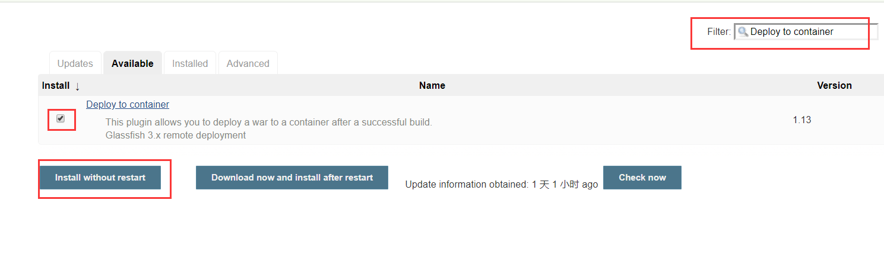
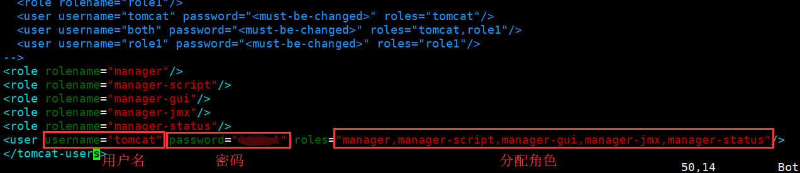
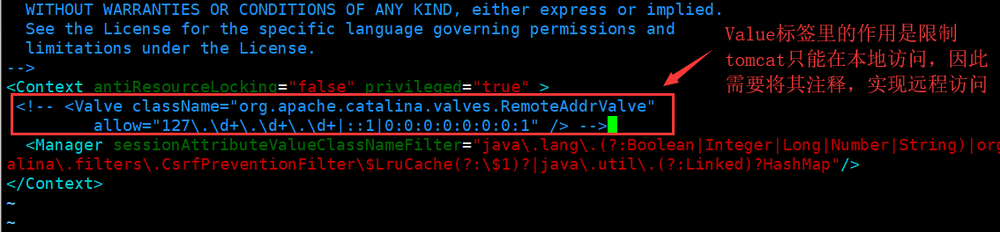
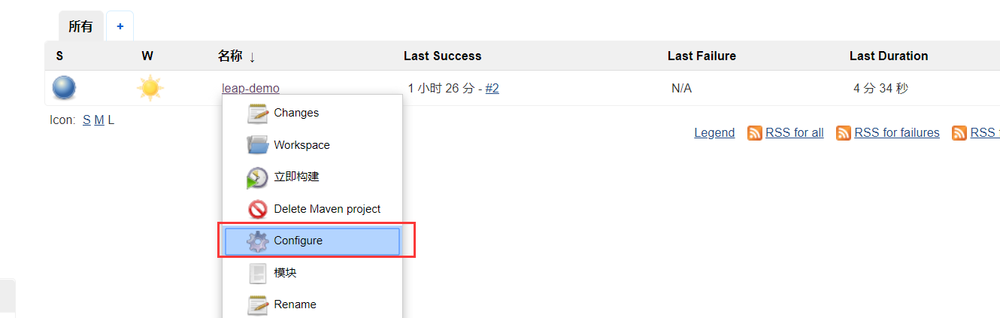
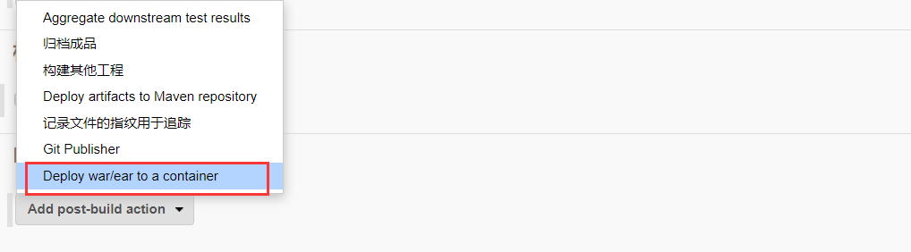
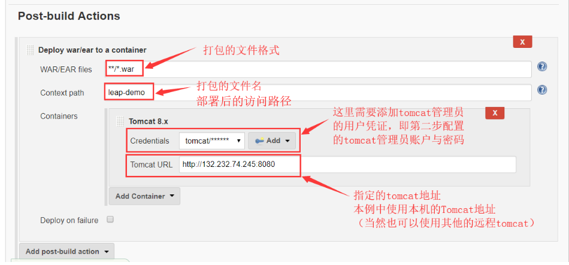

# 自动化部署配置

上一节已经实现了项目自动构建，但这显然还不足以满足我们的需求。我们需要的是在构建完项目之后的同时，将项目部署到Tomcat上去，因此还需要做以下三点配置。

### 一.安装Deploy to container插件

顾名思义，Deploy to container（部署到容器），这个插件，可以帮助我们将构建好的项目自动部署到容器上（本例的容器为Tomcat）。话不多说，安装插件。

进入 “系统管理” → “插件管理”，打开 “Available” 选项卡

搜索 “Deploy to container” 并安装即可。



### 二.Tomcat后台管理配置

Deploy to container插件可以帮我们部署项目到Tomcat上，但它需要拥有对Tomcat的操作权限。因此我们需要对tomcat配置一个管理员账户。

**1.进入tomcat安装目录，修改conf/tomcat-user.xml文件，配置一个拥有全角色的管理员用户**

```
cd /opt/apache-tomcat-9.0.21/conf
vim tomcat-users.xml
```

添加以下配置信息：



```
<role rolename="manager"/>
<role rolename="manager-script"/>
<role rolename="manager-gui"/>
<role rolename="manager-jmx"/>
<role rolename="manager-status"/>
<user username="tomcat" password="这里输入自己的密码" roles="manager,manager-script,manager-gui,manager-jmx,manager-status"/>
```

**2.进入tomcat安装目录，修改webapps/manager/META-INF/context.xml文件，注释掉Value标签，实现tomcat支持远程访问**

```
cd /opt/apache-tomcat-9.0.21/webapps/manager/META-INF
vim context.xml
```




### 三.项目自动部署配置

以上两步做完之后，就可以为测试项目配置自动部署了。

1.进入测试项目的配置页面。



2.找到**Post-build Actions（构建项目后的触发的动作）**，选择“发布war包到容器”





3.点击“应用”与“保存”


**至此，自动化部署配置已完成，接下来就是自动化部署实战！**