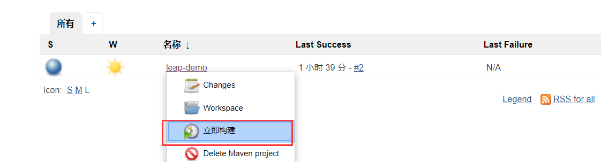
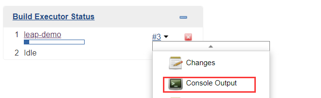
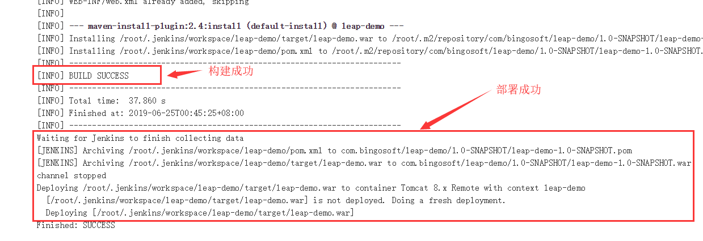
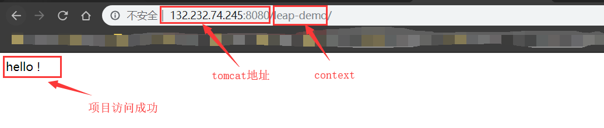
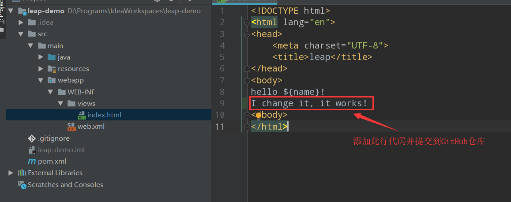
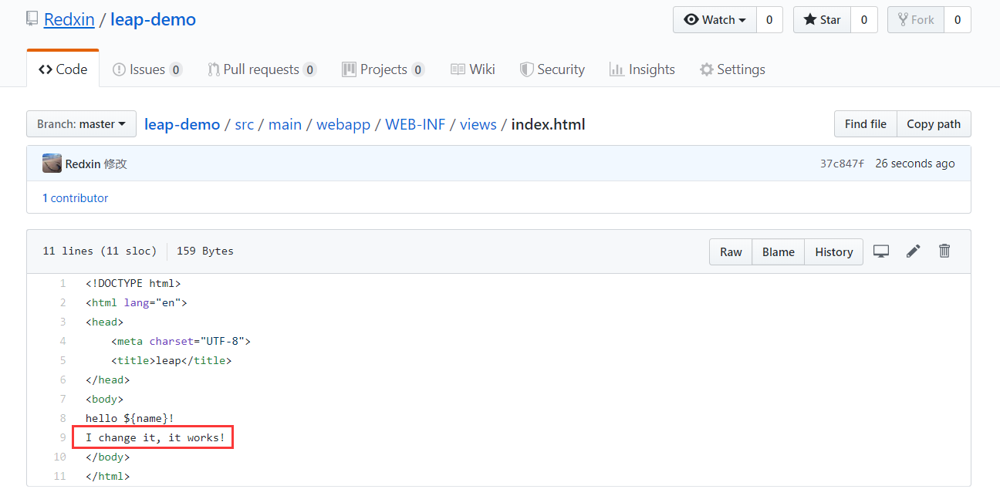
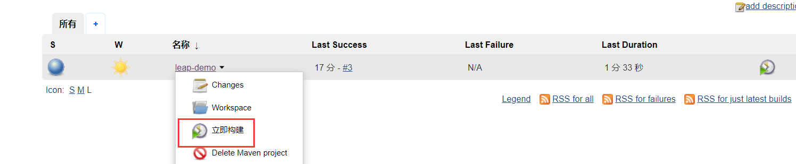
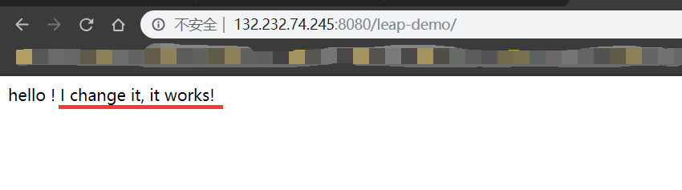

# 自动化部署实战

**实战流程：jenkins项目构建发布 → 项目访问测试 → 修改项目代码 → 提交git → jenkins构建发布 →项目再一次访问测试**

### 一.demo构建发布与测试

**1.进入Jenkins主页，点击“立即构建”**

**2.查看项目部署日志**

**3.访问项目**

出现以上截图，表明Jenkins自动部署成功！

### 二.修改项目代码并提交

### 三.Jenkins再次部署并测试

回到Jenkins 主页，点击立即构建，并访问demo项目

**实战成功！！！**