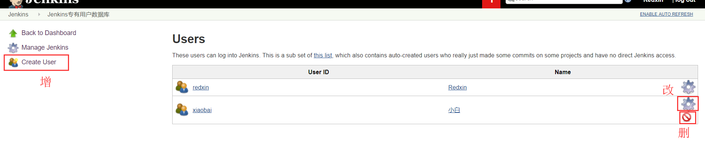
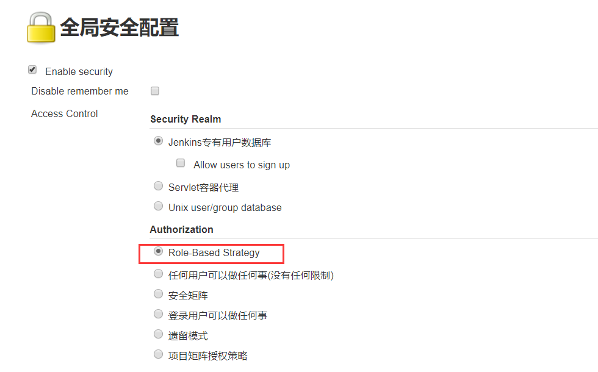
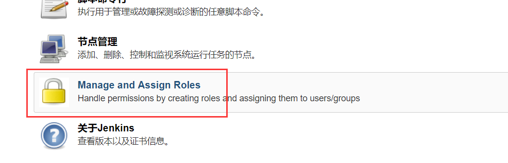
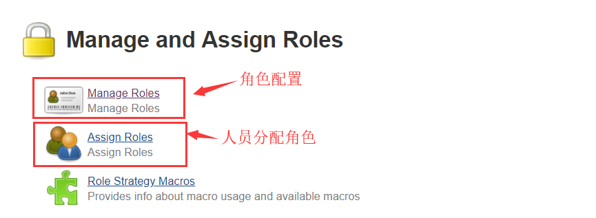

# 用户管理&权限管理

项目往往是以团队形式开发，这就需要我们为团队成员的每一个人创建Jenkins账户与分配不同的权限。

### 一.用户管理

大部分系统都会有一个用户管理，当然Jenkins也不例外，简单的增删查改功能

**“系统管理” → “管理用户”**

### 二.权限管理

权限管理，需要借助一个插件：Role-based Authorization Strategy

##### 1.安装插件Role-based Authorization Strategy

安装插件过程不再赘述。

##### 2.全局安全配置

进入 “系统管理” → “全局安全配置”，

安装完Role-based Authorization Strategy插件后，会多出来一个“Role-Based Strategy”选项，选择并保存

##### 3.权限配置

进入 “系统管理” ，选择“Manage and Assign Roles”

