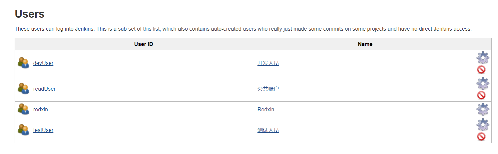
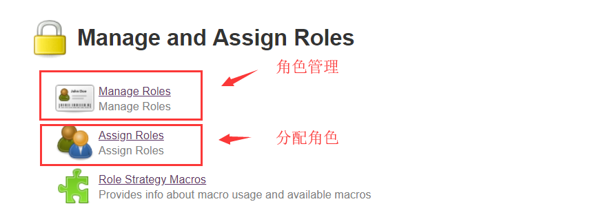
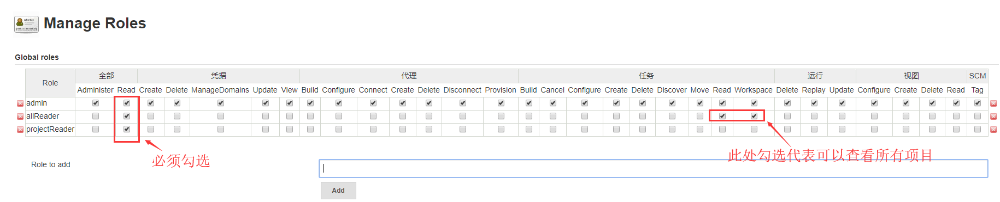
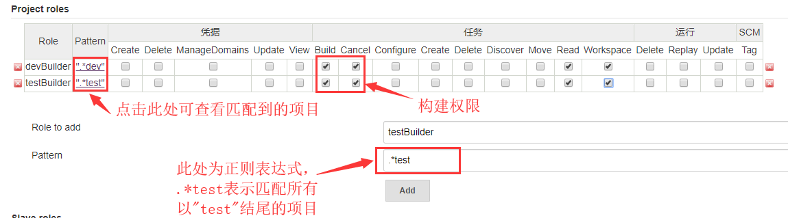
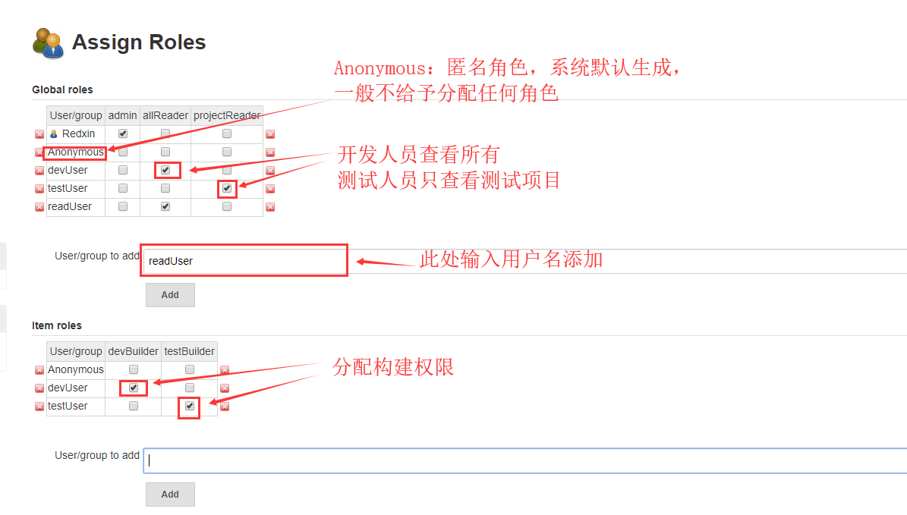
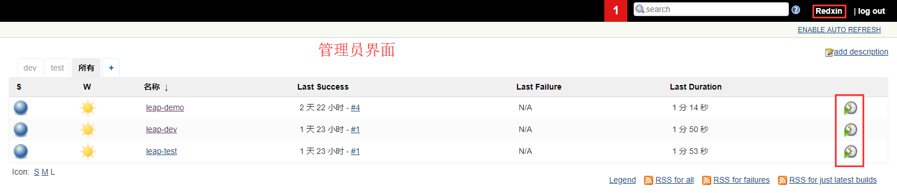
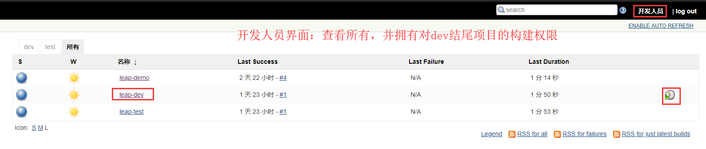
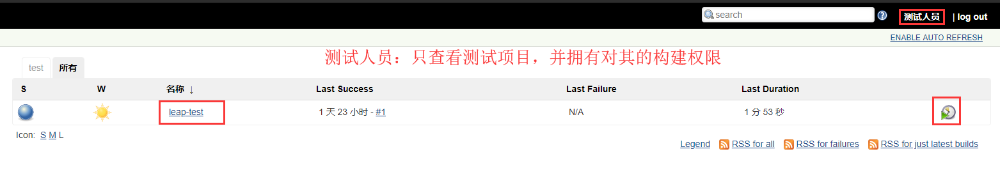
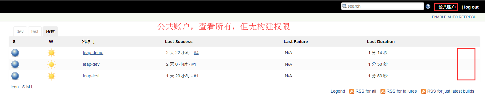

# 用户管理&权限管理

### 一.场景定义

项目往往是以团队形式开发，这就需要我们为团队成员的每一个人创建Jenkins账户并分配不同的权限。

一般情况下，项目都会分成三个环境（正式库、开发库、测试库），同时会有管理员、开发人员、测试人员以及公共账户。管理员拥有所有操作权限，开发人员与测试人员分别负责开发库与测试库的构建发布，公共账户只拥有查看功能。

本例将围绕以下实际场景，进行一个用户管理与权限管理的配置。

##### 项目：

- leap-demo(正式库)
- leap-dev(开发库)
- leap-test(测试库)

##### 用户：

- Redxin(管理员)：拥有所有的操作权限；
- devUser(开发人员)：**可以查看所有项目**，并拥有对开发库（dev结尾的项目）的构建发布权限；
- testUser(测试人员)：**只可以查看test项目**，并拥有对测试库（test结尾的项目）的构建发布权限；
- readUser(公共用户)：可以查看所有项目

### 二.创建用户

大部分系统都会有一个用户管理，当然Jenkins也不例外，简单的增删查改功能

**“系统管理” → “管理用户”**

分别新增devUser、testUser、readUser

### 三.启用权限管理插件

权限管理，需要借助一个插件：Role-based Authorization Strategy

##### 1.安装插件Role-based Authorization Strategy

安装插件过程不再赘述。（详细方法请见[04章](04.Jenkins插件安装.md)）

##### 2.全局安全配置

进入 “系统管理” → “全局安全配置”，

安装完Role-based Authorization Strategy插件后，会多出来一个“Role-Based Strategy”选项，选择并保存

### 四.配置权限策略

进入 “系统管理” ，选择“Manage and Assign Roles”

##### 1.创建角色

进入“Manage Roles”角色管理页面，分别创建 **Global roles**(全局角色)、**Project roles**(项目角色)。

①**Global roles全局角色**：

admin：管理员，拥有所有权限，勾选所有项。

allReader：查看人员，可以查看所有项目（查看所有项目权限需要勾选 【任务】栏的“Read”和“Workspace”）

projectReader：查看人员，只可以查看指定项目（需要配合ProjectRoles中的配置）

②**Project roles项目角色**：

devBuilder：开发库构建人员

testBuilder：测试库构建人员

##### 2.分配角色

进入“Assign Roles”分配页面，进行以下分配即可。

### 五.测试

