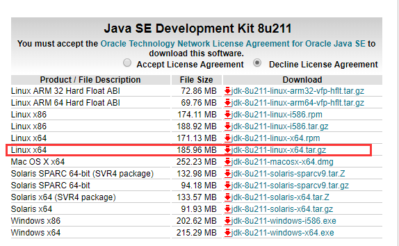

# JDK安装

**安装前说明**:

在安装jdk之前，有必要进行一些默认安装说明。

首先，打开终端，输入 `cd /` 进入系统根目录，再输入 `ll` ，可以看到系统根目录信息。一般情况下，软件都会安装在opt或usr目录下。


在本次安装jdk、maven、tomcat中，软件将安装在opt目录下，基本的安装步骤为：

1：打开Xftp，进入opt目录

2：将安装包拖入该目录下

3：利用Xshell打开终端，进入opt目录，解压安装包 `tar -zxvf 解压包名`

4：配置安装


### 一.卸载系统自带的Open-Jdk

有些机器上，系统默认自带Open-Jdk，这显然不是我们想要的，如果有则需要将其卸载。

1.打开终端：输入 `java -version`，查看是否存在Open-Jdk，

2.若有，则输入命令 `yum -y remove java-1.x.x-openjdk*`，java-1.x.x代表自带的Open-Jdk版本

### 二.下载JDK并将JDK包传输到服务器

[下载地址](<https://www.oracle.com/technetwork/java/javase/downloads/jdk8-downloads-2133151.html>)

1.下载安装包



2.打开Xftp，进入opt目录，并将安装包拖入,传输完成后，打开终端，输入 `ll /opt` 列出opt目录下的文件,若显示有安装包，表明传输成功。

### 三.解压安装包

打开终端：

1.进入opt目录下：`cd /opt`

2.解压安装包：`tar -zxvf jdk-8u11-linux-x64.tar.gz`

3.解压完后，输入 `ll /opt` 列出目录信息，若有列出如下图所示的安装包与解压出来的目录，则表明解压成功


4.解压完后可以删除安装包，输入 `rm -rf jdk-8u11-linux-x64.tar.gz `

5.此时输入`java -version`，提示未找到命令，显然还需要设置环境变量

### 四.设置java环境变量

与windows相同，linux也需要设置环境变量，环境变量是在/etc目录下修改profile

这里推荐使用linux的文本编辑器vim，系统上并没有vim，可以输入以下命令直接安装即可

```
yum -y install vim*
```

**设置环境变量具体步骤**：

1.使用vim文本编辑器打开profile文件: `vim /etc/profile` , （若提示如下截图，键入E即可进入vim编辑）


2.进入vim后，在以下位置配置环境变量信息，保存即可


​	**操作方法：**

- 将光标移动到相应位置

- 键入 “i” 键，进入编辑模式

- 输入环境变量相应信息

- 按 “Esc” 键退出编辑模式，输入`:wq`保存

  **具体配置信息如下**：

  ```
  export JAVA_HOME=/opt/jdk1.8.0_11
  export CLASSPATH=.:$JAVA_HOME/lib/dt.jar:$JAVA_HOME/lib/tools.jar
  export JRE_HOME=$JAVA_HOME/jre
  export PATH=$JAVA_HOME/bin
  ```

3.保存之后，别忘记更新配置文件

​	输入命令: `source /etc/profile`

### 五.测试是否配置成功

输入 `java -version`,若提示以下截图，表明Jdk配置成功！

