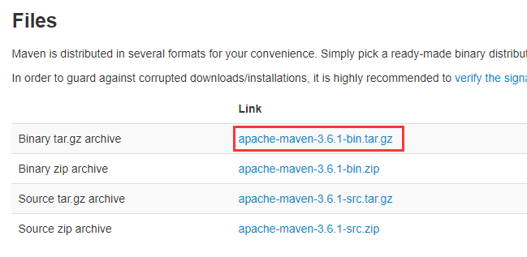
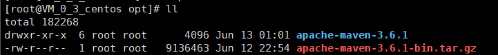
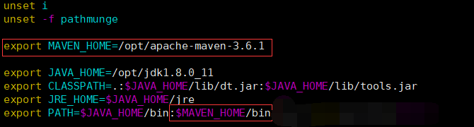
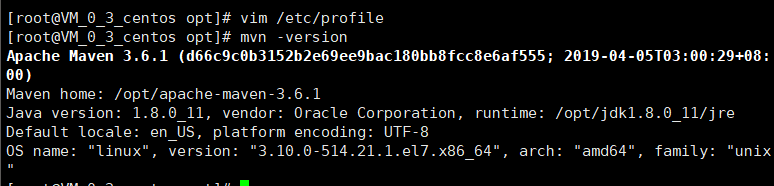

# Maven安装

Maven的安装与JDK安装极其相似

### 一.下载Maven安装包并传输到服务器

[下载地址](<http://maven.apache.org/download.cgi>)

1.下载安装包：



2.打开Xftp，进入opt目录，并将安装包拖入,传输完成后，打开终端，输入 `ll /opt` 列出opt目录下的文件,若显示有Maven安装包，表明传输成功。


### 二.解压安装包

打开终端：

1.进入opt目录下：`cd /opt`

2.解压安装包：`tar -zxvf apache-maven-3.6.1-bin.tar.gz`

3.解压完后，输入 `ll /opt` 列出目录信息，若有列出如下图所示的安装包与解压出来的目录，则表明解压成功



4.解压完后可以删除安装包，输入 `rm -rf apache-maven-3.6.1-bin.tar.gz `

5.此时输入`mvn-version`，提示未找到命令，显然还需要设置环境变量


### 三.配置Maven环境变量

1.使用vim文本编辑器打开profile文件（vim操作方法请看2.1JDK安装页面）: `vim /etc/profile` 

2.在profile文件中追加以下配置信息并保存



```
export MAVEN_HOME=/opt/apache-maven-3.6.1
export PATH=$JAVA_HOME/bin:$MAVEN_HOME/bin
```

3.更新配置文件 `source /etc/profile`


### 四.验证是否配置成功

输入 `mvn -version`,若提示以下截图，表明Maven配置成功！

