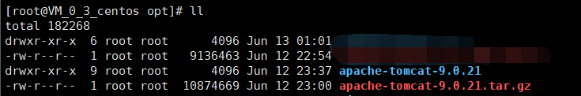

# Tomcat安装

国际惯例，下载→传输→解压→配置→测试！

### 一.下载Tomcat安装包并传输到服务器

[下载地址](<https://tomcat.apache.org/download-90.cgi>)

1.下载安装包：


2.打开Xftp，进入opt目录，并将安装包拖入,传输完成后，打开终端，输入 `ll /opt` 列出opt目录下的文件,若显示有Tomcat安装包，表明传输成功。

### 二.解压安装包

打开终端：

1.进入opt目录下：`cd /opt`

2.解压安装包：`tar -zxvf apache-tomcat-9.0.21.tar.gz`

3.解压完后，输入 `ll /opt` 列出目录信息，若有列出如下图所示的安装包与解压出来的目录，则表明解压成功



4.解压完后可以删除安装包，输入 `rm -rf apache-tomcat-9.0.21.tar.gz `

5.此时输入`mvn-version`，提示未找到命令，显然还需要设置环境变量

### 三.启动tomcat

测试启动tomcat

1.进入tomcat下的bin目录： `cd /opt/apache-tomcat-9.0.21/bin`

2.列出目录信息：`ll`


3.启动tomcat：`sh startup.sh`


### 四.测试是否启动成功

可以本地访问tomcat地址，来测试tomcat是否启动成功。输入以下命令：

```
curl http://localhost:8080
```

若显示以下截图信息，则表明tomcat正常启动成功！

