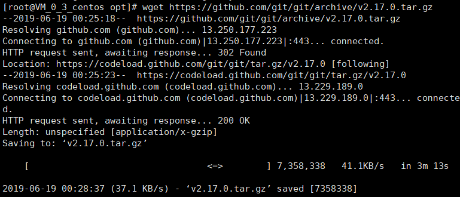
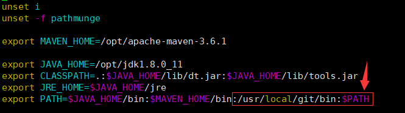
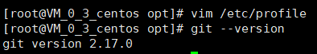
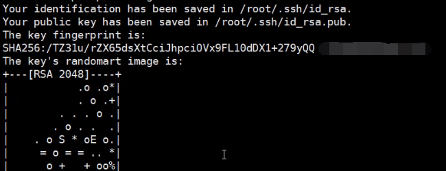
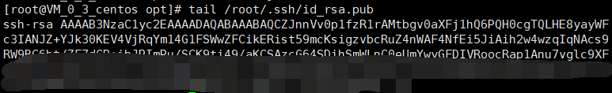
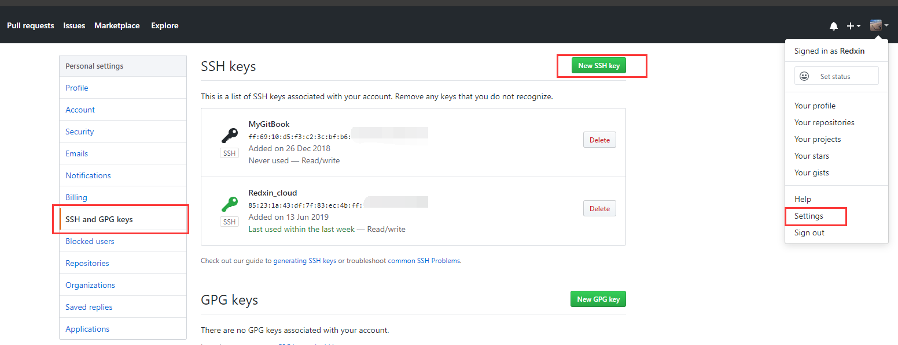
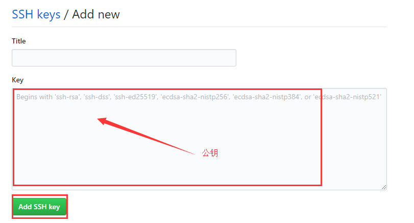
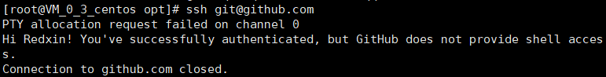

# Git安装与配置

### 一.下载git源码安装包并解压

linux下，可以直接通过命令行下载源码安装包。操作步骤：

1.打开终端，进入opt目录下: `cd /opt`

2.输入命令，直接下载源码安装包：

```
wget https://github.com/git/git/archive/v2.17.0.tar.gz
```

3.提示如下截图，代表下载完成



4.解压安装包

```
tar -zxvf v2.17.0.tar.gz
```


### 二.安装git

**1.安装编译源码所需依赖**

```
yum install curl-devel expat-devel gettext-devel openssl-devel zlib-devel gcc perl-ExtUtils-MakeMaker
```

**2.卸载旧版Git**

​	在第三步安装依赖时，yum会自动安装了旧版Git，因此需要卸载旧版本Git，命令为：

```
yum remove git
```

​	出现提示输入y即可

**3.执行编译**

​	进入解压后的文件夹：`cd git-2.17.0`

​	执行编译，命令为：

```
make prefix=/usr/local/git all
```

**4.安装Git**

​	安装Git至/usr/local/git路径，命令为：

```
make prefix=/usr/local/git install
```


### 三.配置环境变量

打开配置文件：`vim /etc/profile`

添加以下Git相关配置信息：



```
export PATH=$JAVA_HOME/bin:$MAVEN_HOME/bin:/usr/local/git/bin:$PATH
```


### 四.测试git是否安装完成

输入 `git --version`,若提示以下截图，表明Git安装成功！




### 五.Git配置

**1.配置用户名与邮箱**

```
git config --global user.name yourName
git config --global user.email yourEmail
```

​	**注意：**yourName，yourEmail分别填自己的git用户名与邮箱

**2.生成公钥**

```
ssh-keygen -t rsa -C yourEmail
```

若提示以下信息表明生成公钥成功



**3.复制公钥**

输入以下命令，打印公钥并复制出来

```
tail /root/.ssh/id_rsa.pub
```



**4.登录个人Github并添加公钥**





**5.测试连接到Github**

```
ssh git@github.com
```

出现以下截图代表配置公钥成功！

