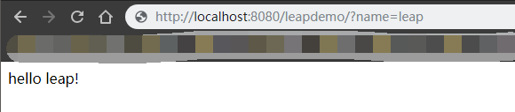

# 测试工程准备

在学习过程中，需要有一个**maven项目**进行自动化部署测试。若开发者手头已有自己的git项目，则直接使用即可。

**本例将使用基于leap的一个很简单很简单的小demo进行测试**：

git地址：https://github.com/Redxin/leap-demo.git

项目详细搭建过程可前往 [*Leap入门教程文档*](<https://leapframework.gitbooks.io/doc/content/quickstart.html>) 查看。

项目演示：

------

### 以上，若均准备好之后，就可以进入Jenkins学习正题了！